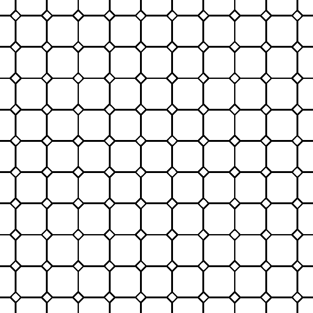
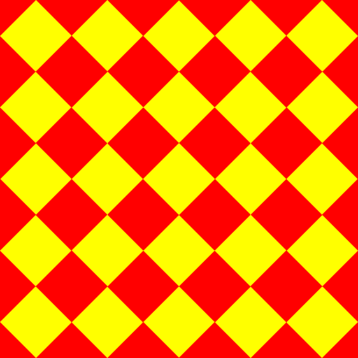

glsl_frag_shader.py is to reproduce the glsl fragment shader samples in "The Book of Shaders (https://thebookofshaders.com/)".   

"The Book of Shaders" is very good a teaching book for glsl fragment shader.  
In "The Book of Shaders", in order to execute sample of glsl fragment shaders web application that called "glslEditor" is prepared.  
It's easy to try.  
Reason why I wrote glsl_frag_shader.py, I wanted to generate an image of any size using python script.

In here, some fragment shader sample is included.  

## dependency
glsl_frag_shader.py depends on python3 modules argparse, numpy, time, pillow and OpenGL related modules.

## how to use
Usage is below:

`python3 glsl_frag_shader.py [-s WIDTH HEIGHT] FILE`

Easily, execute as follows.

`python3 glsl_frag_shader.py FILE`

FILE means glsl fragment shader programs that like introduced in "The Book of Shaders".  
When executing glsl_frag_shader.py, FILE is reproduced as OpenGL window image. you can get both 24bit rgb color PNG image and 16bit grayscale PNG image into same directory at that timing if you hit 'p' key. And you can stop this script if you hit 'q' key.

## for examples

`python3 glsl_frag_shader.py checker_plate.frag`

 

 `python3 glsl_frag_shader.py cross_pattern.frag`

 

 `python3 glsl_frag_shader.py diamondtiles.frag`

 

 `python3 glsl_frag_shader.py dragon_scales.frag`

 

 `python3 glsl_frag_shader.py heart.frag`

 

 `python3 glsl_frag_shader.py hexagon.frag`

 

 `python3 glsl_frag_shader.py ichimatsu.frag`

 

 `python3 glsl_frag_shader.py ichimatsu2.frag`

 

 `python3 glsl_frag_shader.py kagome.frag`

 

 `python3 glsl_frag_shader.py kanoko.frag`

 

 `python3 glsl_frag_shader.py shippo.frag`

 

 `python3 glsl_frag_shader.py uroko.frag`

 
